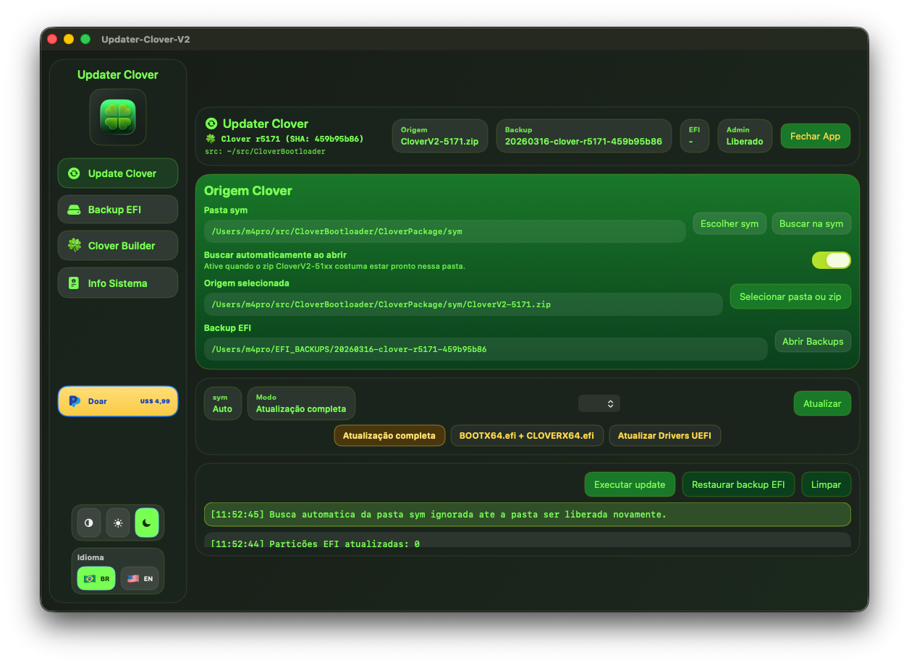
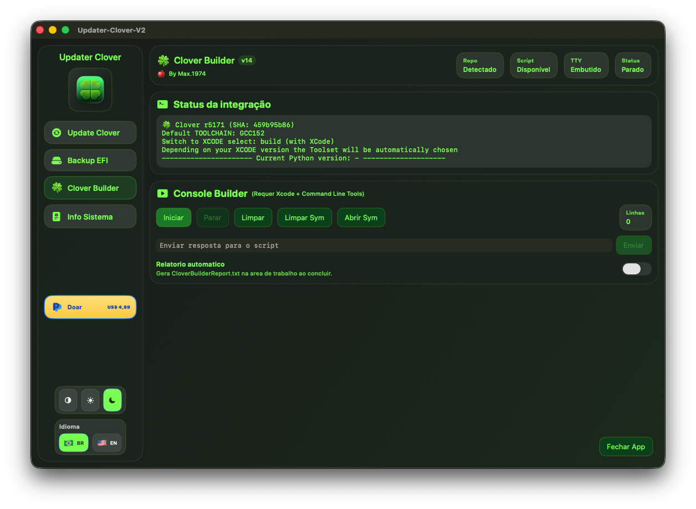
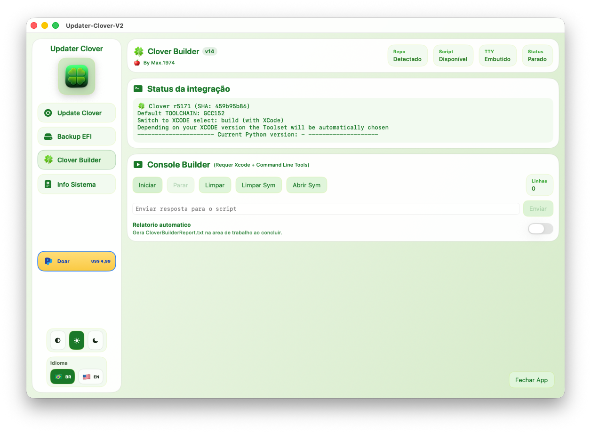
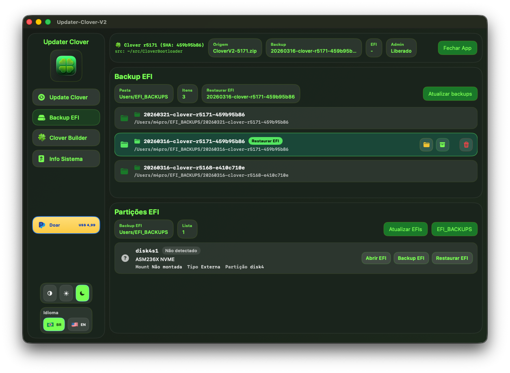
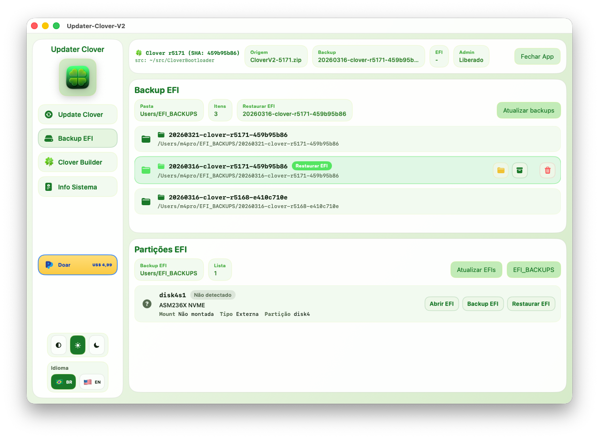
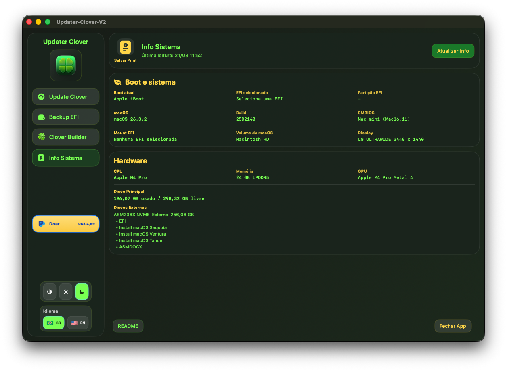

# Tutorial do Updater Clover

## Demo

- Video no YouTube: [Updater Clover V2 Demo](https://youtu.be/4cEeanEK1qo)

## Capturas atuais













## Visao geral

O Updater Clover e um aplicativo macOS para atualizar arquivos essenciais do Clover em uma particao EFI, criar backups completos, restaurar backups EFI e consultar informacoes do sistema.

## Idiomas e tema

- `BR` deixa a interface em portugues do Brasil.
- `EN` deixa a interface em ingles.
- Os botoes de tema alternam entre modo claro, escuro ou automatico do sistema.

## Aba Update Clover

Esta e a area principal para atualizar os arquivos do Clover.

### O que o app atualiza

O app copia apenas os arquivos necessarios para a atualizacao segura:

- `EFI/BOOT/BOOTX64.efi`
- `EFI/CLOVER/CLOVERX64.efi`
- `ApfsDriverLoader.efi`
- `OpenRuntime.efi`
- `VBoxHfs.efi`

No modo completo, ele tambem sincroniza:

- `EFI/CLOVER/tools`

### Origem esperada

O app procura primeiro os drivers em:

```text
EFI/CLOVER/Drivers/Off/UEFI
```

Se a origem for um backup simples contendo apenas a pasta `EFI`, tambem aceita:

```text
EFI/CLOVER/Drivers/UEFI
```

### Como usar

1. Clique em `Selecionar Clover v2` para escolher uma pasta extraida ou um arquivo `.zip`.
2. Escolha a particao EFI desejada.
3. Monte a EFI, se necessario.
4. Escolha o modo de atualizacao.
5. Execute a atualizacao.

## Aba Backup EFI

Esta area serve para navegar pelos backups salvos e restaurar uma EFI.

### Recursos

- listar backups em `~/EFI_BACKUPS`
- atualizar a lista de backups
- abrir a pasta de backups
- copiar o caminho de um backup
- restaurar um backup para a EFI selecionada

### Como restaurar

1. Abra a aba `Backup EFI`.
2. Selecione um backup valido da lista.
3. Escolha a particao EFI correta.
4. Execute a restauracao.

## Aba Info Sistema

Mostra o resumo do hardware e do estado atual do boot.

### Informacoes exibidas

- boot atual
- EFI selecionada
- particao EFI
- versao do macOS
- modelo do Mac
- CPU
- GPU
- memoria
- disco principal
- discos externos

### Screenshot

Passe o mouse sobre o icone de informacao e clique para salvar uma captura da tela de `Info Sistema` na pasta `Downloads`.

## Open Sym

O botao `Open Sym` abre a pasta `sym` configurada no app.

Se a pasta ainda nao estiver autorizada, selecione-a novamente quando o app solicitar.

## Permissao administrativa

Algumas acoes exigem senha de administrador para montar ou alterar a EFI.

### O que pode acontecer

- o app pode mostrar um alerta proprio pedindo a senha
- o macOS pode mostrar uma janela nativa do Acesso as Chaves

Essa janela do sistema segue o idioma do proprio macOS.

## Doacao

O botao de doacao abre o link do PayPal configurado no app com o valor sugerido de `US$ 4,99`.

## Dicas importantes

- sempre confira a particao EFI antes de atualizar ou restaurar
- mantenha backups em `~/EFI_BACKUPS`
- use a aba `Info Sistema` para validar o boot atual antes de alterar a EFI
- se algo parecer incorreto, feche o app e confira a origem selecionada

## Solucao de problemas

### Nao encontrei a EFI

- clique em atualizar a lista
- confirme se o disco esta conectado
- verifique se a EFI ja nao esta montada

### A pasta sym nao foi encontrada

- selecione novamente a pasta `sym`
- confirme se o caminho ainda existe

### O app abriu em portugues e eu quero ingles

- clique em `EN`

### O tutorial nao abriu

- feche e abra o app novamente
- confirme se esta usando a versao mais recente compilada

